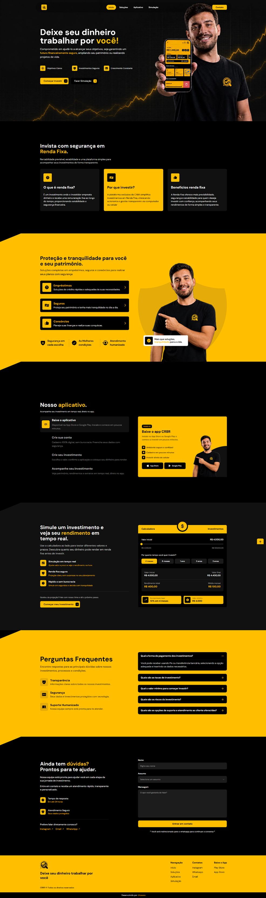

# CRBR Investimentos 💵

## 📚 Informações sobre o projeto

* Desenvolvimento de uma página institucional, com o objetivo de apresentar a empresa e seus tipos de trabalhos. Apresentando tipos de investimentos,serviços, aplicativo e formas de contato.

## 💻 Seções do projeto

* Hero
* Tipo de Investimento
* Soluções
* Aplicativo
* Simulação
* FAQ
* Contato
&nbsp;

## 🎨 Telas do projeto

&nbsp;

## 🛠️ Tecnologias/Ferramentas utilizadas

* React
* TypeScript
* Tailwind
* Shadcn/UI
* Framer Motion
* GSAP
* PhosphorIcons

&nbsp;

---

Feito com 🧡 por <a href="https://www.instagram.com/jhoww.dev/">Jhonatas Micael</a>

